# NewsletterHub

NewsletterHub is a PHP + MySQL web application for creating, publishing, and distributing category-based newsletters. It supports role-based access, writer submissions, admin approvals, and a public blog feed derived from published newsletters.

## Highlights
- Role-based access for Admin, Member, and Writer accounts
- Email + OTP login flow
- Category subscriptions and subscription management
- Writer submission workflow with admin approval
- Newsletter publishing with automatic blog entry creation
- Feedback collection and admin dashboard

## Tech Stack
- PHP
- MySQL
- PHPMailer (SMTP email delivery)
- HTML/CSS/JS

## Project Structure
- `php/`: server-side PHP handlers and pages
- `css/`: stylesheets
- `Database/`: database schema and seed data
- `Screenshots/`: UI screenshots
- `*.html`: public pages and forms

## Screenshots
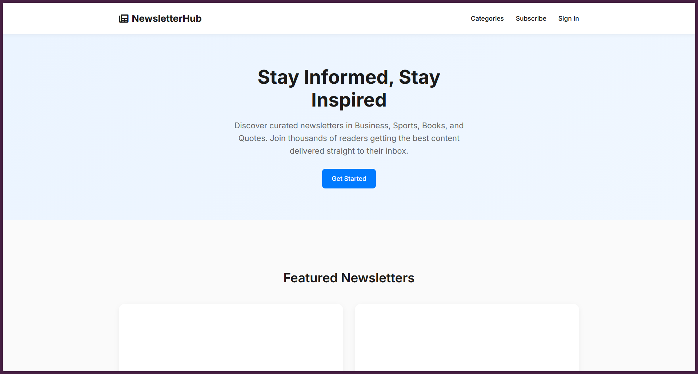
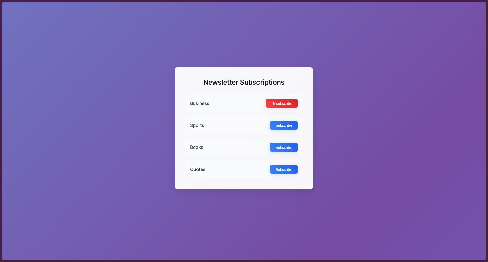
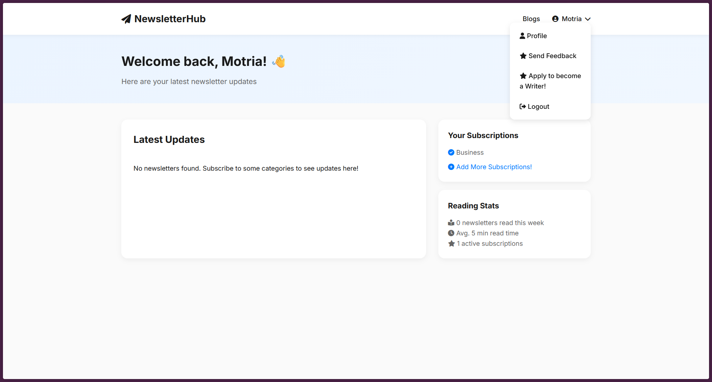
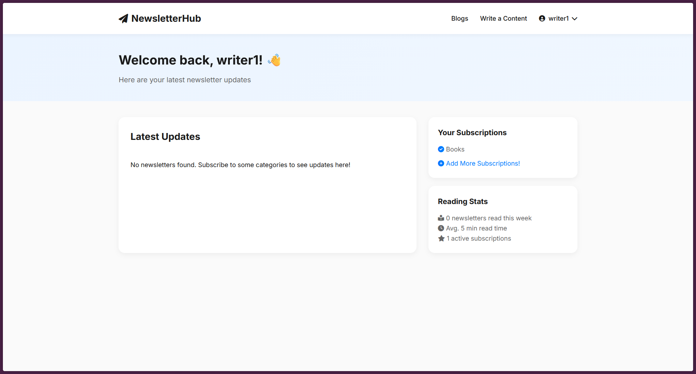
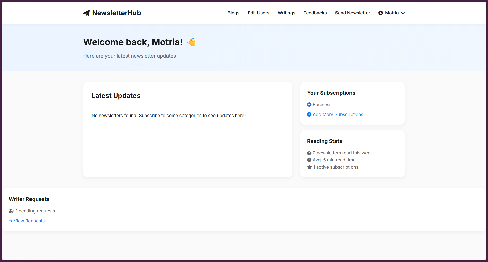

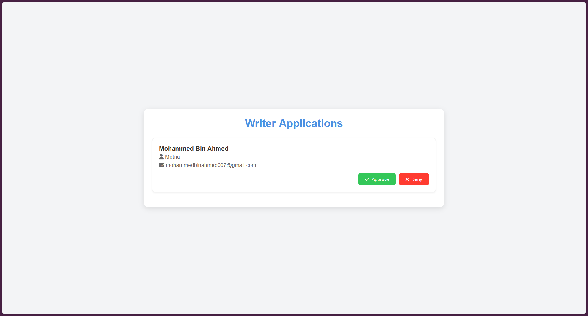
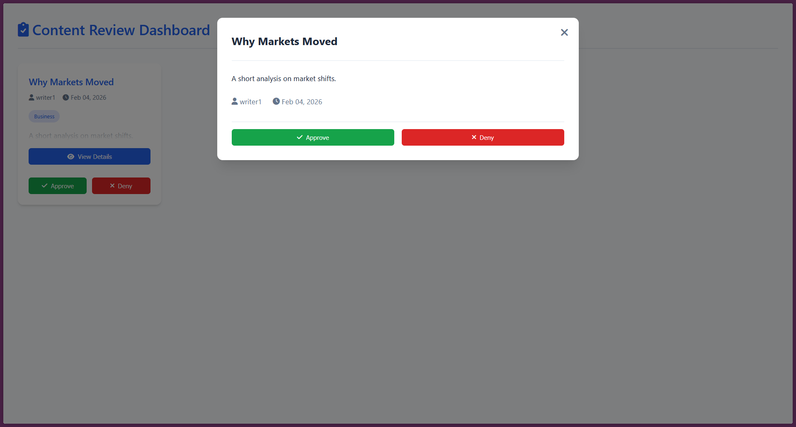
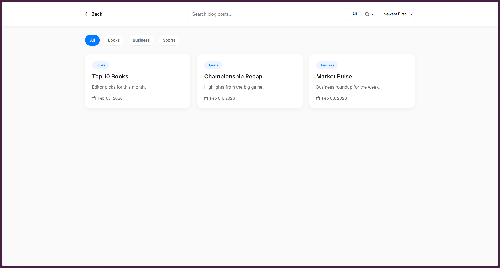
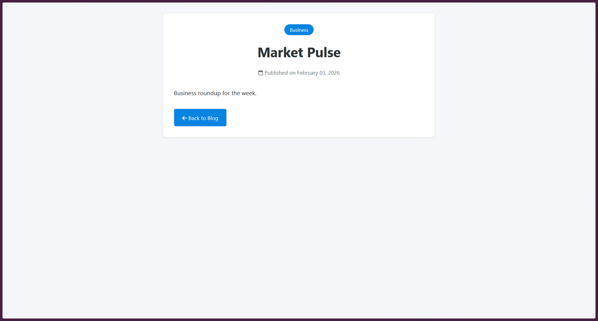

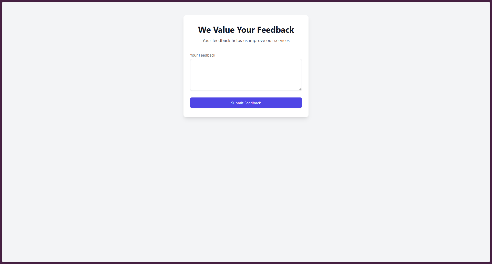
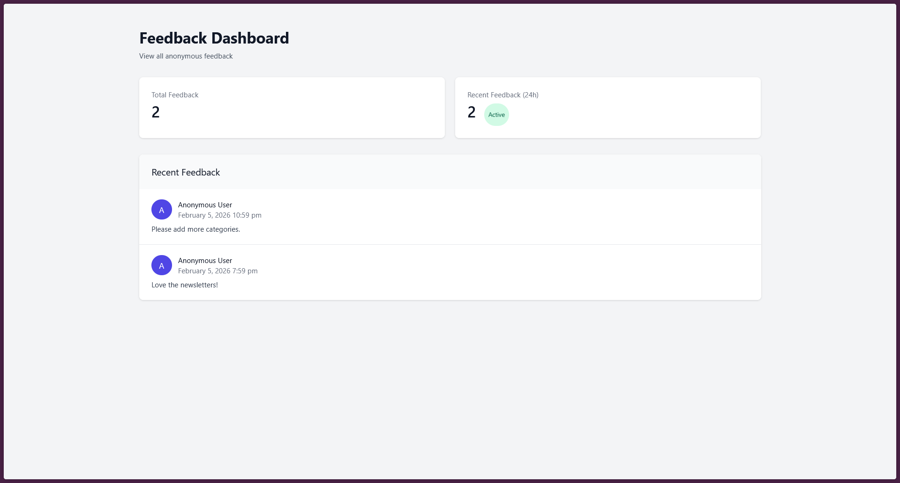
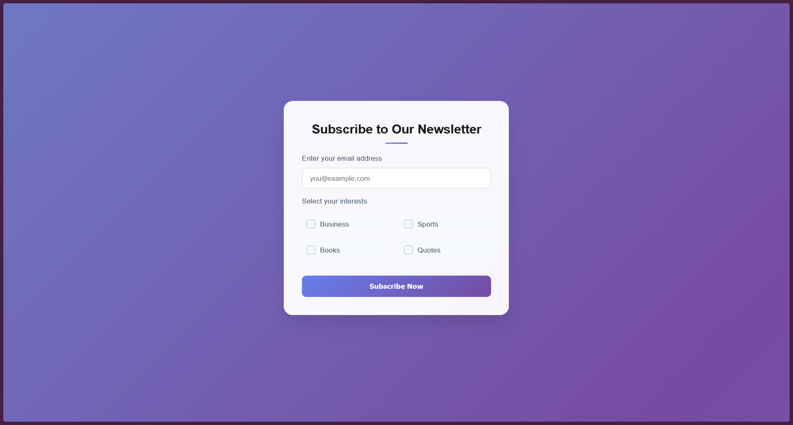

## Setup
1. Install prerequisites: PHP 8.x, MySQL 8.x, and a local web server (Apache, Nginx, or PHP built-in server).
2. Create the database by importing `Database/newsletter.sql`.
3. Configure database credentials in `php/db.php`.
4. Configure email SMTP credentials using environment variables (see `.env.example`).
5. Start your web server at the project root and open `index.html` in your browser.

## Environment Variables
- `SMTP_HOST`
- `SMTP_PORT`
- `SMTP_USERNAME`
- `SMTP_PASSWORD`
- `SMTP_FROM`

## Default Data
- Roles: Admin, Member, Writer
- Categories: Business, Sports, Books, Quotes

## Security Notes
- SMTP credentials are read from environment variables. Do not commit real secrets.
- The project does not include automated migrations; the schema lives in `Database/newsletter.sql`.

## License
Specify your license here.
